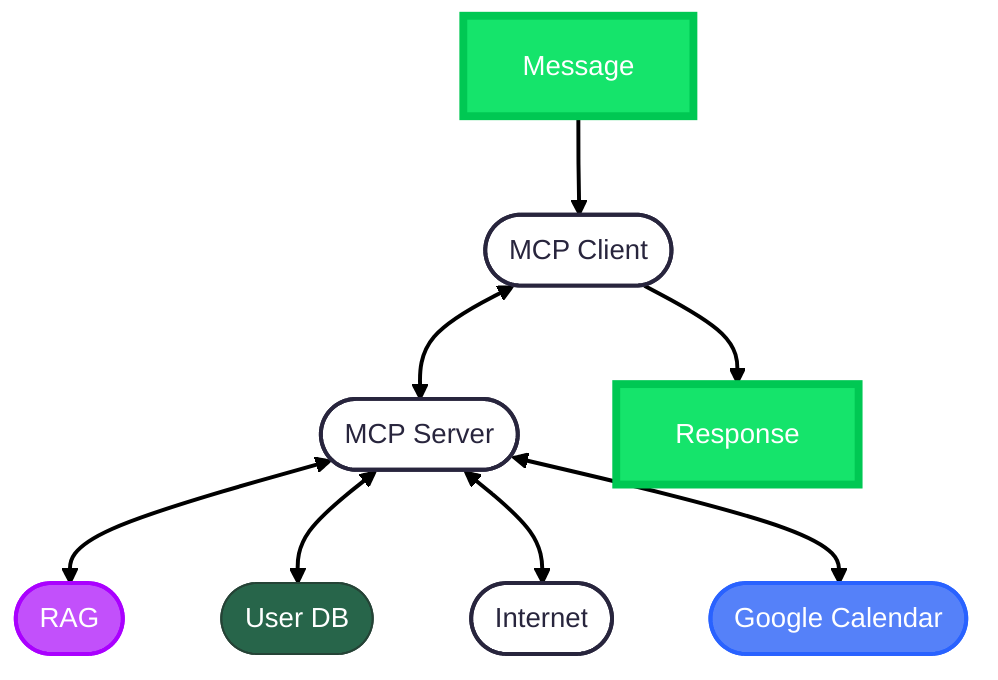

# 🏗️ Architecture Overview – EconomIAssist
EconomIAssist is a conversational financial assistant that helps users manage their personal finances by interacting through WhatsApp. It leverages NLP to understand user input, stores financial data in Google Sheets, creates reminders in Google Calendar, and operates using a modular message-passing architecture known as MCP (Message Communication Protocol).

---
## 🧱 System Components
```
User → WhatsApp → Agent (NLP) → MCP → Actions:
    - Google Sheets
    - Google Calendar
    - Response Message
```
---

## 🔁 Response Process Flow

1.  **Receive**:

    * The user sends a message via WhatsApp, such as:

        * ```“Gasto $2000 en comida hoy”```
        * ```“Me pagaron el sueldo de $120.000”```

2. **Understand**:

    * The NLP agent processes the input to detect intent and extract entities.

3. **Generate**:

    * The system determines the appropriate response or action (e.g., logging the expense or scheduling a reminder).

4. **Respond**:

    * A message is sent back to the user via WhatsApp with a confirmation or relevant information.

    * The system may also update a backend (Google Sheets/Google Calendar) and notify the user.

---

## 📦 Modules and Responsibilities

Module|Description
---|---
```src/agent/```| NLP pipeline: intent detection, entity recognition, query understanding
```src/integrations/```|Interfaces with external services (Google Sheets, Google Calendar, WhatsApp via Twilio)
```src/mcp/```|	Defines and handles message formats, routing, and communication across modules
```src/workflows/```|	Orchestrates business logic such as logging expenses and generating reports
```src/utils/```|	Shared utility functions for formatting, validation, etc.


---

## 🔌 External Integrations

Integration|	Role
---|---
**WhatsApp (Twilio)**	|Main user interface for messaging
**Google Sheets**	|Backend storage for income and expense logs
**Google Calendar**	|Manages reminders and scheduled events
**Internet Access**	|Allows real-time retrieval or verification of financial info
**Graphical Tools**	|Generate statistical graphs and reports for visual insight

---
## 📈 General Infrastructure



